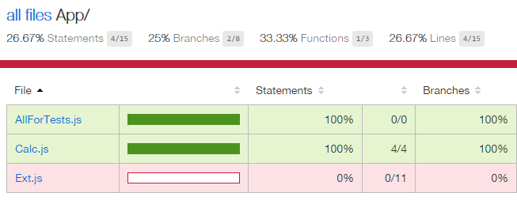

# "Include All" with gulp and karma-coverage

Example project using Require.js and file path patterns. 
Prooving it is possible to get 0% coverage and not worry about
confliciting implementations.

> Note: you **don't need** to use Require.js across the solution.

---



---

Setup:

    npm install

Run:

    npm test

or:

    gulp coverage

---

### How is it working?

- Set pattern to match all files but include none:

```
{pattern: 'Scripts/App/**/*.js', included: false},
{pattern: 'Scripts/Test/**/*Spec.js', included: false},
```

- Configure require.js

```
var tests = [];
for (var file in window.__karma__.files) {
    if (/Spec\.js$/.test(file)) {
        tests.push(file);
    }
}

require(['/base/Scripts/App/Calc.js']);

requirejs.config({
    deps: tests,
    callback: window.__karma__.start
});
```

- Use additional flag for Istanbul

```
coverageReporter: {
    includeAllSources: true,
    ...
}
```